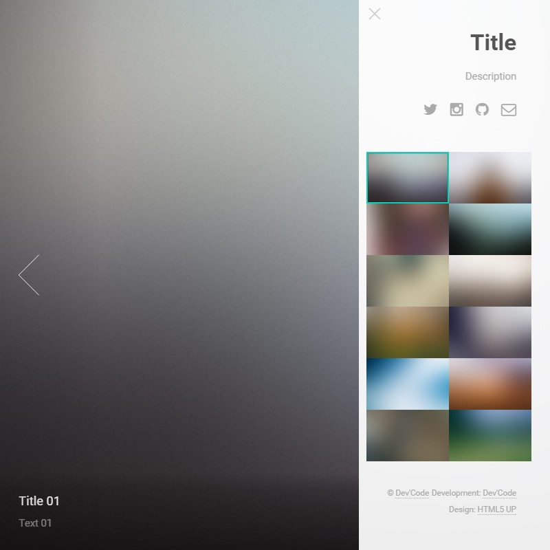

# Lens

Lens is a simple Grav theme, originally designed by HTML5 UP.

# Installation

Installing the Lens theme can be done in one of two ways. The GPM (Grav Package Manager) installation method enables you to quickly and easily install the theme with a simple terminal command, while the manual method enables you to do so via a zip file.

## GPM Installation (Preferred)

The simplest way to install this theme is via the [Grav Package Manager (GPM)](http://learn.getgrav.org/advanced/grav-gpm) through your system's Terminal (also called the command line).  From the root of your Grav install type:

    bin/gpm install lens

This will install the Lens theme into your `/user/themes` directory within Grav. Its files can be found under `/your/site/grav/user/themes/lens`.

## Manual Installation

To install this theme, just download the zip version of this repository and unzip it under `/your/site/grav/user/themes`. Then, rename the folder to `lens`. You can find these files either on [GitHub](https://github.com/lab-dev-code/grav-theme-lens) or via [GetGrav.org](http://getgrav.org/downloads/themes).

You should now have all the theme files under

    /your/site/grav/user/themes/lens

# Updating

## GPM Update (Preferred)

The simplest way to update this theme is via the [Grav Package Manager (GPM)](http://learn.getgrav.org/advanced/grav-gpm). You can do this with this by navigating to the root directory of your Grav install using your system's Terminal (also called command line) and typing the following:

    bin/gpm update lens

This command will check your Grav install to see if your Lens theme is due for an update. If a newer release is found, you will be asked whether or not you wish to update. To continue, type `y` and hit enter. The theme will automatically update and clear Grav's cache.

## Manual Update

Manually updating Lens is pretty simple. Here is what you will need to do to get this done:

* Delete the `your/site/user/themes/lens` directory.
* Download the new version of the lens theme from either [GitHub](https://github.com/lab-dev-code/grav-theme-lens) or [GetGrav.org](http://getgrav.org/downloads/themes).
* Unzip the zip file in `your/site/user/lens` and rename the resulting folder to `lens`.
* Clear the Grav cache. The simplest way to do this is by going to the root Grav directory in terminal and typing `bin/grav clear-cache`.

> Note: Any changes you have made to any of the files listed under this directory will also be removed and replaced by the new set. Any files located elsewhere (for example a YAML settings file placed in `user/config/themes`) will remain intact.

## Features

* Lightweight and minimal for optimal performance
* Fully responsive with off-page mobile navigation
* SCSS based CSS source files for easy customization
* Fontawesome icon support

### Supported Page Templates

* Default view template

### How to use it ?

A complete Lens page front-matter looks this way :

    ---
    title: Title
    description: Description
    links:
        twitter: 'http://url/of/a/twitter/account'
        instagram: 'http://url/of/a/instagram/account'
        github: 'http://url/of/a/github/account'
        email: 'mailto:mail@adress'
    credits:
        url: 'http://url/of/your/credits/link'
        text: 'Text of your credits link'
    images:
        -
            title: 'Title of the image N°01'
            text: 'Text of the image N°01'
            full: 'http://url/of/the/first/image'
            thumb: 'http://url/of/the/first/image/thumbnail'
        -
            title: 'Title of the image N°02'
            text: 'Text of the image N°02'
            full: 'http://url/of/the/second/image'
            thumb: 'http://url/of/the/second/image/thumbnail'
        -
            *repeat for each image*
    ---
